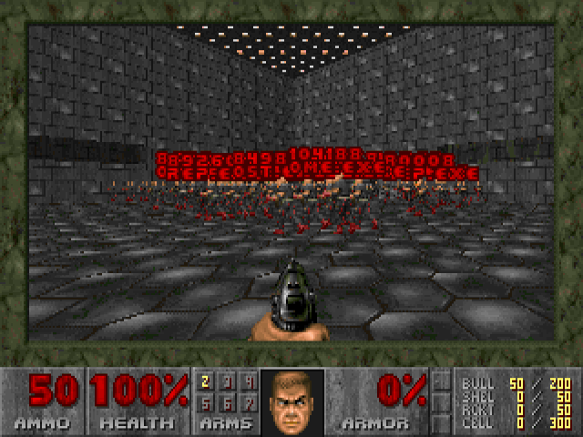

# Fight the Machine

```
    ███████╗██╗ ██████╗ ██╗  ██╗████████╗    ████████╗██╗  ██╗███████╗
    ██╔════╝██║██╔════╝ ██║  ██║╚══██╔══╝    ╚══██╔══╝██║  ██║██╔════╝
    █████╗  ██║██║  ███╗███████║   ██║          ██║   ███████║█████╗
    ██╔══╝  ██║██║   ██║██╔══██║   ██║          ██║   ██╔══██║██╔══╝
    ██║     ██║╚██████╔╝██║  ██║   ██║          ██║   ██║  ██║███████╗
    ╚═╝     ╚═╝ ╚═════╝ ╚═╝  ╚═╝   ╚═╝          ╚═╝   ╚═╝  ╚═╝╚══════╝
              ███╗   ███╗ █████╗  ██████╗██╗  ██╗██╗███╗   ██╗███████╗
              ████╗ ████║██╔══██╗██╔════╝██║  ██║██║████╗  ██║██╔════╝
              ██╔████╔██║███████║██║     ███████║██║██╔██╗ ██║█████╗
              ██║╚██╔╝██║██╔══██║██║     ██╔══██║██║██║╚██╗██║██╔══╝
              ██║ ╚═╝ ██║██║  ██║╚██████╗██║  ██║██║██║ ╚████║███████╗
              ╚═╝     ╚═╝╚═╝  ╚═╝ ╚═════╝╚═╝  ╚═╝╚═╝╚═╝  ╚═══╝╚══════╝
```

## What it is

A DOOM where every monster is one of your running processes. Kill the monster
and the process dies. It is a Windows port of [psDoom-ng](https://github.com/orsonteodoro/psdoom-ng),
which is built on Chocolate Doom.

```
  ╔═════════════════════════════════╗    ╔═════════════════════════════════╗
  ║ NATIVE WINDOWS  -  real kills   ║    ║ WIN32 + QEMU  -  sandboxed      ║
  ╠═════════════════════════════════╣    ╠═════════════════════════════════╣
  ║                                 ║    ║                                 ║
  ║ fightthemachine.exe             ║    ║ fightthemachine.exe (WebView2)  ║
  ║   │                             ║    ║           │                     ║
  ║   ├──▶ Toolhelp32 snapshot      ║    ║           ▼                     ║
  ║   │      every process = monster║    ║ ┌──────── QEMU VM ────────┐     ║
  ║   │                             ║    ║ │ Linux + psDoom-ng       │     ║
  ║   └──▶ TerminateProcess         ║    ║ │ monster dies ─▶ kill -9 │     ║
  ║          on monster death       ║    ║ │ respawner revives it    │     ║
  ║                                 ║    ║ └─────────────────────────┘     ║
  ║ protected: explorer, csrss ...  ║    ║                                 ║
  ║ safe mode: notepad, calc, paint ║    ║ your Windows is untouched       ║
  ╚═════════════════════════════════╝    ╚═════════════════════════════════╝
```

How the pieces fit: [docs/architecture.md](docs/architecture.md).

## Status

**v1.1.0, alpha.** [Latest release](https://github.com/sp00nznet/fightthemachine/releases/latest).

| Build | State |
|---|---|
| Native Windows | Usable. Builds under MSYS2 and runs on shareware `doom1.wad`, Ultimate DOOM, DOOM II and Freedoom (all checked 2026-09-26). |
| Win32 + QEMU | Untested since its CI was retired. The build scripts are in the repo, but nobody has checked them lately. |

[](https://github.com/sp00nznet/fightthemachine/actions/workflows/ci.yml) GitHub Actions builds and packages the native port on every push. Release ZIPs come from CI.

## Screenshots

The psDoom arena on the shareware `doom1.wad`. Each monster is labelled with its PID and process name:



## Getting Started

For the native Windows build. It kills **real** processes, and safe mode is on by default.

1. Download `FightTheMachine-Native-<version>.zip` from the
   [Releases](https://github.com/sp00nznet/fightthemachine/releases) page.
2. Extract it anywhere. It contains the game, its DLLs, the psDoom levels, and
   the shareware `doom1.wad`, so nothing else needs installing.
3. Double-click `run.bat`. It prints your settings and waits for a key:
   ```
   Current settings (edit fightthemachine.cfg to change):
     Scale: 2x
     Windowed: 1
     Safe Mode: 1
   ```
4. Press a key. The game opens in a 640x400 window at the title screen. Start a
   new game and you spawn in the psDoom arena, surrounded by a shotgun guy or
   demon for every process.

**Have the full game?** Put `doom.wad` (Ultimate DOOM) or `doom2.wad` (DOOM II)
beside `fightthemachine.exe`. The engine picks the best IWAD in the folder in
this order: `doom2.wad`, `doom.wad`, `doom1.wad`. Freedoom works too, but because
the shipped `doom1.wad` outranks it, pass `-iwad freedoom1.wad`. Final DOOM
(`plutonia.wad`, `tnt.wad`) runs, but psDoom spawns no process monsters in it.

## Usage

```bat
:: what run.bat does with the default config
fightthemachine.exe -2 -window

:: pick an IWAD explicitly
fightthemachine.exe -iwad doom2.wad -window

:: jump straight into the arena
fightthemachine.exe -warp 1 1 -window

:: monsters but no killing (dry run)
fightthemachine.exe -nopsact -window

:: lift safe mode - any process that isn't protected can die
fightthemachine.exe -unsafe -window
```

`fightthemachine.cfg` drives `run.bat`:

| Key | Values | Effect |
|---|---|---|
| `SCALE` | `2`–`6` | Window size, 2 = 640x400 |
| `WINDOWED` | `1` / `0` | Window or fullscreen |
| `SAFE_MODE` | `1` / `0` | `0` passes `-unsafe` |

### Who dies

| Mode | Can be killed |
|---|---|
| Safe (default) | `notepad.exe`, `calc.exe`, `calculatorapp.exe`, `mspaint.exe` |
| `-unsafe` | Anything not protected |
| Never | `system`, `csrss.exe`, `lsass.exe`, `svchost.exe`, `winlogon.exe`, `explorer.exe`, `dwm.exe`, Defender, the game itself, and `claude.exe` (it helped build this) |

The full protected list is `WIN32_BLACKLIST` in [native/windows/pr_process.c](native/windows/pr_process.c).
System and service processes appear as **demons**. Everything else appears as a
**shotgun guy**.

### Controls and cheats

| Key | Action | | Cheat | Effect |
|---|---|---|---|---|
| Arrows | Move | | `sudo` | God mode + all weapons (this project's own) |
| `Ctrl` | Fire | | `iddqd` | God mode |
| `Space` | Use / open | | `idkfa` | All weapons and ammo |
| `1`–`7` | Weapon | | `idclip` | No clipping |
| `Tab` | Automap | | | |

## Building from source

Native Windows, from a clean machine:

1. Install [MSYS2](https://www.msys2.org/) to `C:\msys64`.
2. In the **MSYS2 MINGW64** shell:
   ```bash
   pacman -S mingw-w64-x86_64-gcc mingw-w64-x86_64-cmake \
             mingw-w64-x86_64-SDL mingw-w64-x86_64-SDL_mixer \
             mingw-w64-x86_64-SDL_net mingw-w64-x86_64-libpng git make
   ```
3. Build. The first run clones psDoom-ng into `psdoom-ng-src/` and patches it:
   ```bash
   cd native/windows
   ./build-windows.sh          # --unsafe compiles safe mode out entirely
   ```
   Output: `native/windows/build/fightthemachine.exe`.
4. To build the release ZIP, run this from PowerShell. It downloads `doom1.wad`
   and checks its md5:
   ```powershell
   .\native\windows\package.ps1            # or -SkipBuild to reuse build/
   ```
   Output: `dist/FightTheMachine-Native-<describe>.zip`.

Win32 + QEMU: see [win32/README.md](win32/README.md) and [qemu/](qemu/).

Why the level WADs are patched, and the crash that forced it:
[docs/iwads.md](docs/iwads.md).

## License

GPL v2 for the engine and psDoom level data. The shareware `doom1.wad` in the
release ZIP is id Software's, freely distributable as shareware. It is never
committed to this repo. Details in [LICENSE](LICENSE) and [PROVENANCE.md](PROVENANCE.md).

Built on [DOOM](https://github.com/id-Software/DOOM) (id Software),
[Chocolate Doom](https://www.chocolate-doom.org/) (Simon Howard),
[psDoom](http://psdoom.sourceforge.net/) (Dennis Chao),
[psDoom-ng](https://github.com/orsonteodoro/psdoom-ng) (Orson Teodoro) and
[keymon's fork](https://github.com/keymon/psdoom-ng).

<p align="center"><i>RIP AND TEAR, UNTIL IT IS DONE.</i></p>
